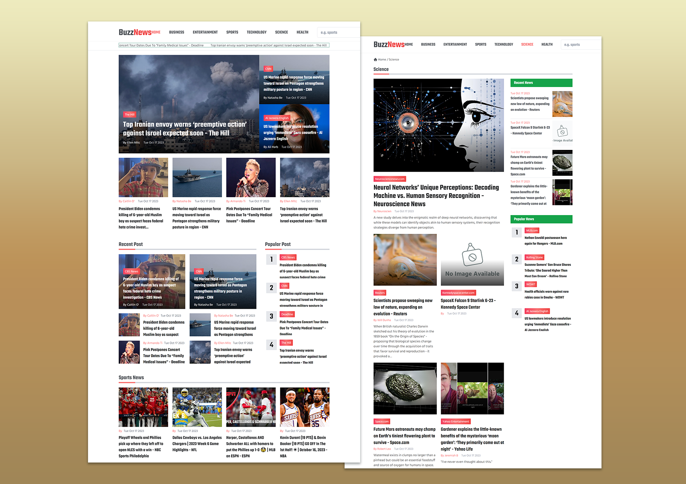

## Project Name: Buzz News
### About the project
**Buzz News** is a website that provides users with the latest news from around the world. The app utilizes the NewsAPI to gather news articles. This app allows users to read the latest news articles from many popular website sources.

### Tech stack
- React.js
- News API, Contenful headless CMS
- TailwindCSS
- React-router
- React-slick
- more...

### Features
- Responsive **Buzz News** Website Using TailwindCSS
- Compatible with all mobile devices and with a beautiful and pleasant user interface.
- Display the latest news articles from popular websites.
- Filter news by categories and specific articles.
- Search for specific articles
- Select News title with a smooth marquee
- Touch and scroll with the news slider.

👉 Live Demo: <a href='https://buzz-news.vercel.app/'>Buzz News Demo</a>

### Screenshots of the Project

  

<!-- 

  <h2 align="center">Gymate - React Fitness Exercises Application</h2>

  - Includes: choose exercises categories and specific muscle groups
  - Includes: browse more than 1000 exercises
  - Includes: exercises pagination .

  <a href="https://codewithsadee.github.io/fitlife/"><strong>➥ Live Demo</strong></a>

 

### Demo Screeshots

 -->
